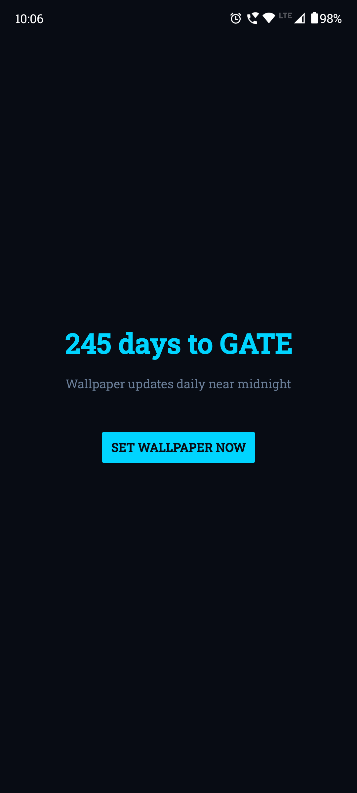
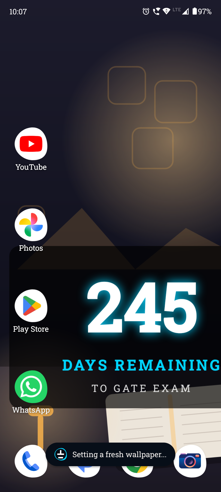
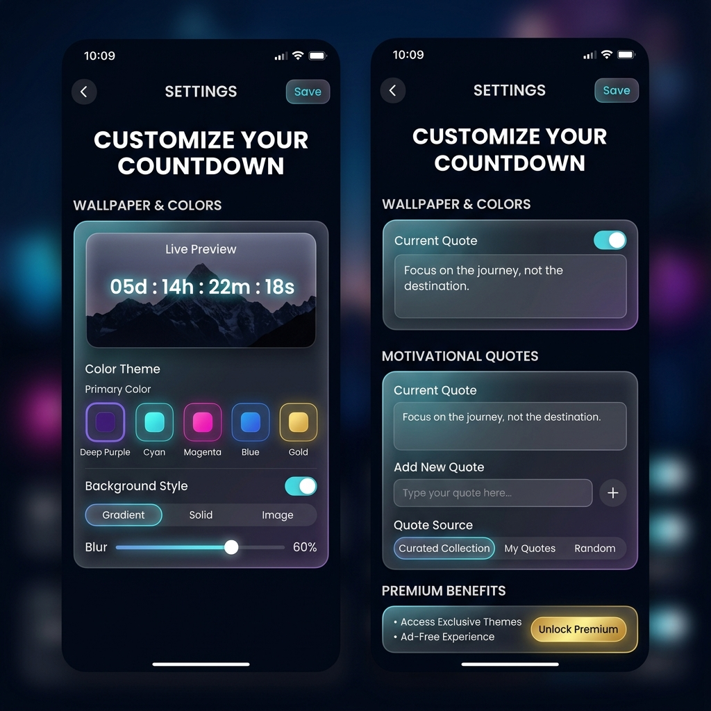

<div align="center">
  
  <h1>Exam Countdown Wallpaper</h1>
  <p><strong>A motivational daily countdown live wallpaper app for major competitive exams.</strong></p>

  <a href="https://github.com/Pk-Boss99/GATE2027_Remainder/releases/latest">
    
  </a>
</div>

---

## 🚀 Overview
**Crushing competitive exams requires daily focus and unbreakable motivation.** 

The Exam Countdown Wallpaper app is not just a timer; it’s a daily driver for your success. Every time you unlock your phone, you are reminded exactly how much time you have left to prepare, pushing you to make every second count. 

## ✨ Features
- 🔥 **Always Visible:** Replaces your wallpaper with a beautiful, dynamic countdown to your exam.
- 🎯 **Multi-Exam Support:** Choose from pre-configured popular exams (UPSC, NEET, IIT-JEE, GATE) or create a Custom Exam.
- 🇮🇳 **Indian Exam Database:** Instantly detects the dates for 25+ major Indian competitive exams without needing an internet connection.
- 🔄 **In-App Updater:** Automatically detects and downloads new releases right from GitHub directly inside the app!
- 📅 **Daily Updates:** The days tick down automatically, keeping the urgency alive.
- 🔋 **Battery Efficient:** Extremely lightweight, so it won’t drain your phone while you study.

## 📱 Screenshots

<p align="center">
  
  
  
</p>

---

## 💻 For Developers

### Local Build
To build this project locally, ensure you have Android Studio installed. 

Create a `local.properties` file in the root directory and specify your SDK path:
```properties
sdk.dir=your_android_sdk_path
```

Then build the debug APK:
```powershell
.\gradlew.bat testDebugUnitTest assembleDebug
```
